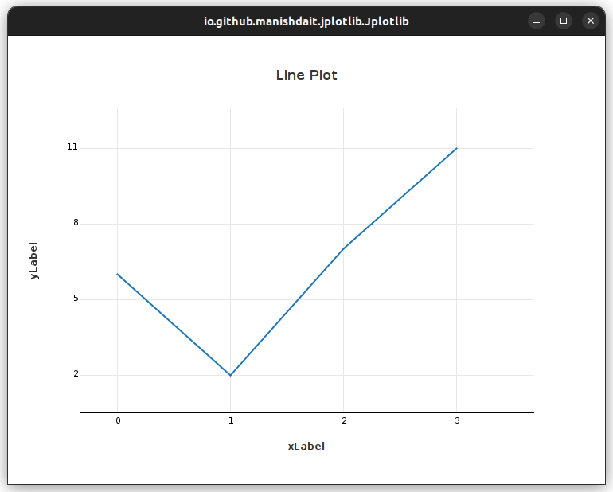
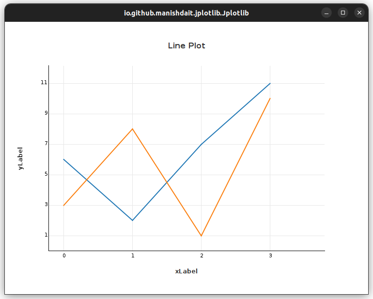

# Jplotlib
Jplotlib is a data visualization library for Java, inspired by the popular
Python library Matplotlib. It provides a simple and intuitive way to create charts and graphs for analyzing and presenting data.

## Features

- **Easy-to-Use**: Jplotlib is straightforward and easy to use, allowing users to create visualizations with minimal code. The syntax is inspired by Matplotlib, making it accessible to those familiar with Python's data visualization capabilities.

- **Various Chart Types**: Jplotlib currently supports several chart types, like line plots, scatter plots, bar plots and pie charts. Users can choose the appropriate chart type to effectively represent their data.

- **Customization Options**: The library offers extensive customization options for charts. Users can control titles, labels, colors, markers, and line styles to tailor visualizations to their specific needs.


## Getting Started

To use Jplotlib in your Java project, follow these steps:

1. **Download the Jplotlib Library**: Obtain the Jplotlib library as a JAR file from the official Jplotlib GitHub repository.

2. **Add the Jplotlib JAR to Your Project**: Add the Jplotlib JAR file to your project's classpath. If you use an integrated development environment (IDE), include the JAR as a library dependency.


## How to use

Here is an example for plotting simple Line Plot.

```java
import io.github.manishdait.jplotlib.Jplotlib;

public class App {
  public static void main(String[] args) {
    Jplotlib jplotlib = new Jplotlib();
    double[] y = {6, 2, 7, 11};

    jplotlib.grid(true, true);
    jplotlib.title("Line Plot");
    jplotlib.xLabel("xLabel");
    jplotlib.yLabel("yLabel");
    jplotlib.plot(y);
    jplotlib.show();
  }
}
```


Another Example to draw **MultiLine Plot**

```java
import io.github.manishdait.jplotlib.Jplotlib;

public class App {
  public static void main(String[] args) {
    Jplotlib jplotlib = new Jplotlib();
    double[] y1 = {6, 2, 7, 11};
    double[] y2 = {3, 8, 1, 10};

    jplotlib.grid(true, true);
    jplotlib.title("Line Plot");
    jplotlib.xLabel("xLabel");
    jplotlib.yLabel("yLabel");
    jplotlib.plot(y1);
    jplotlib.plot(y2);
    jplotlib.show();
  }
}
```



Learn More about Jplotlib in [GETTING_STARTED.md](docs/GETTING_STARTED.md)

## License

The Jplotlib is licensed under the MIT License. See the `LICENSE` file for more information.
