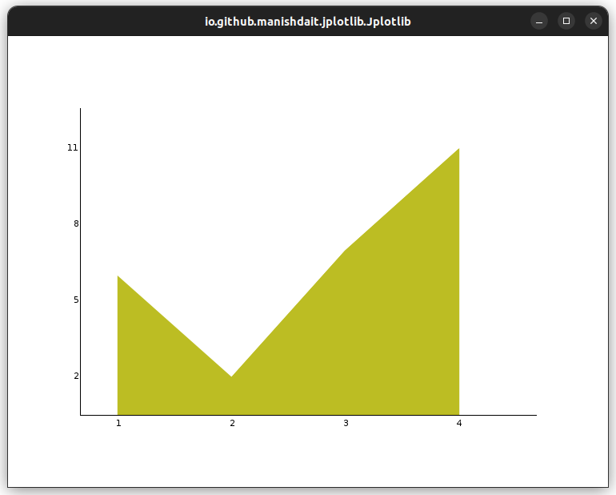
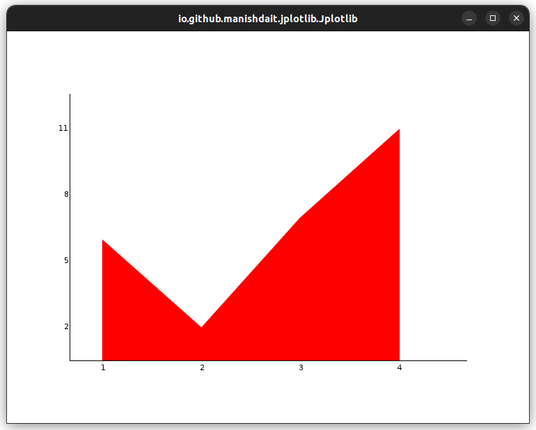
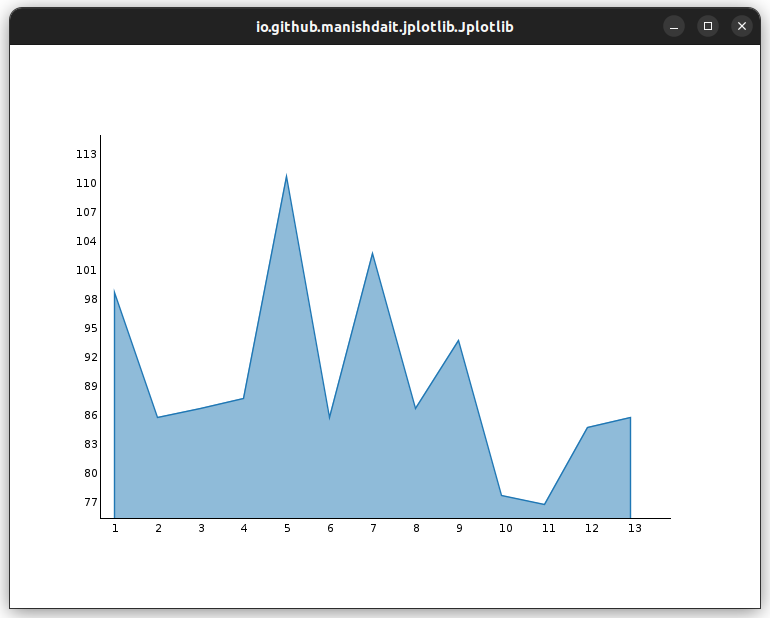
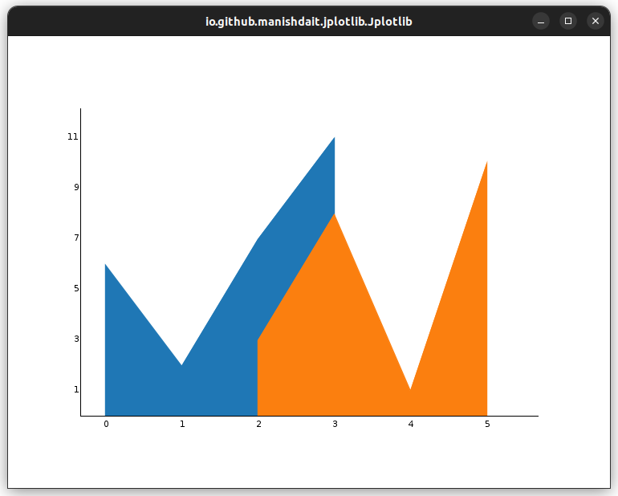
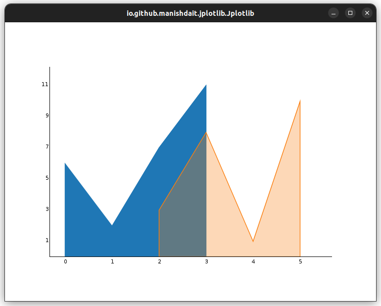

# Jplotlib.areaPlot()

The `areaPlot()` method in the `Jplotlib.areaPlot()` allows you to create 2D area plots with ease. This method is designed to visualize datasets using y-coordinates and x-coordinates:

## Method Signatures
`areaPlot(double[] xPoints, double[] yPoints)`:
   - Description: Plots a 2D area chart using the given x-coordinates and y-coordinates.
   - Example usage:
     ```java
     double[] xCoords = {1.0, 2.0, 3.0, 4.0};
     double[] yCoords = {2.5, 5.1, 3.9, 6.2};
     new Jplotlib.areaPlot(xCoords, yCoords);
     ```


## Area Color

To customize the color of the area in the chart, you can use the `.color()` method available in the Jplotlib library. This method allows you to specify the color using either the `LibColor` enum from Jplotlib or the `java.awt.Color` class.

### Using `LibColor` from Jplotlib:

The `LibColor` enum provides a set of predefined colors that you can use to style the line in your plot. Here's an example of how to use it:

```java
import io.github.manishdait.jplotlib.Jplotlib;
import io.github.manishdait.jplotlib.defaults.color.LibColor;

public class App {
  public static void main(String[] args) {
    Jplotlib jplotlib = new Jplotlib();
    double[] y = {6, 2, 7, 11};
    double[] x = {1, 2, 3, 4};
    jplotlib.areaPlot(x, y)
      .color(LibColor.LIME.getColor());
    jplotlib.show();
  }
}
```

In this example, we use the `.color(LibColor.LIME.getColor())` method to set the color of the line to lime.



For more information about the `LibColor` enum and the available colors, refer to the [LibColor Enum section](LIB_COLOR.md).


### Using `java.awt.Color`:

If you prefer to use the `java.awt.Color` class, you can do so as follows:

```java
import java.awt.Color;
import io.github.manishdait.jplotlib.Jplotlib;

public class App {
  public static void main(String[] args) {
    Jplotlib jplotlib = new Jplotlib();
    double[] y = {6, 2, 7, 11};
    double[] x = {1, 2, 3, 4};
    jplotlib.areaPlot(x, y)
      .color(Color.RED);
    jplotlib.show();
  }
}
```

In this example, we use the `.color(Color.RED)` method to set the color of the line to red.



Whichever method you choose, the `.color()` method allows you to customize the appearance of your line plots with different colors according to your preferences.


## Alpha

In Jplotlib, you can adjust the transparency of the area in area plots using the `.alpha()` method. This feature allows you to control the opacity of area, making the area plot visually more informative and expressive.

### Example Usage:

```java
import io.github.manishdait.jplotlib.Jplotlib;

public class App {
  public static void main(String[] args) {
    double[] x = {1, 2, 3, 4, 5, 6, 7, 8, 9, 10, 11, 12, 13};
    double[] y = {99,86,87,88,111,86,103,87,94,78,77,85,86};

    Jplotlib jplotlib = new Jplotlib();
    jplotlib.areaPlot(x, y)
      .alpha(0.5F);
    jplotlib.show();
  }
}
```

In this example, we use the `.alpha()` argument with the areaPlot() method to set the transparency (opacity) of the aarea in the area plot. The `alphaValue` is a float value between 0 and 1, where 0 means completely transparent (invisible) area, and 1 means completely opaque (fully visible) area.

By adjusting the transparency of the area, you can reveal underlying patterns in the data, especially when data points overlap closely together. It helps in visualizing the density of data points and identifying areas with overlaping concentration.




## Multiples Lines

You can plot as many area chart as you like by simply adding more `Jplotlib.areaPlot()` method calls:

### Example Usage:

```java
import io.github.manishdait.jplotlib.Jplotlib;

public class App {
  public static void main(String[] args) {
    Jplotlib jplotlib = new Jplotlib();
    double[] x1 = {0, 1, 2, 3};
    double[] x2 = {2, 3, 4, 5};
    double[] y1 = {6, 2, 7, 11};
    double[] y2 = {3, 8, 1, 10};
    jplotlib.areaPlot(x1, y1);
    jplotlib.areaPlot(x2, y2);
    jplotlib.show();
  }
}
```

In this example, we create two sets of y-coordinates (`y1` and `y2`) and  two sets of x-coordinates (`x1` and `x2`) and plot them using two separate `Jplotlib.areaPlot()` method calls.



### Example Usage:

```java
import io.github.manishdait.jplotlib.Jplotlib;

public class App {
  public static void main(String[] args) {
    Jplotlib jplotlib = new Jplotlib();
    double[] x1 = {0, 1, 2, 3};
    double[] x2 = {2, 3, 4, 5};
    double[] y1 = {6, 2, 7, 11};
    double[] y2 = {3, 8, 1, 10};
    jplotlib.areaPlot(x1, y1);
    jplotlib.areaPlot(x2, y2).alpha(0.3f);
    jplotlib.show();
  }
}
```

In this example, we create two sets of y-coordinates (`y1` and `y2`) similar to above example but with alpha.




