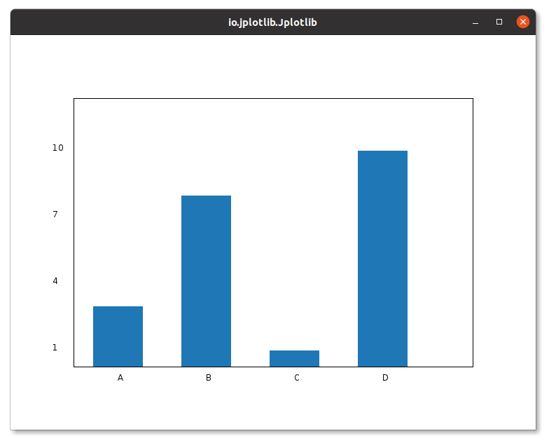
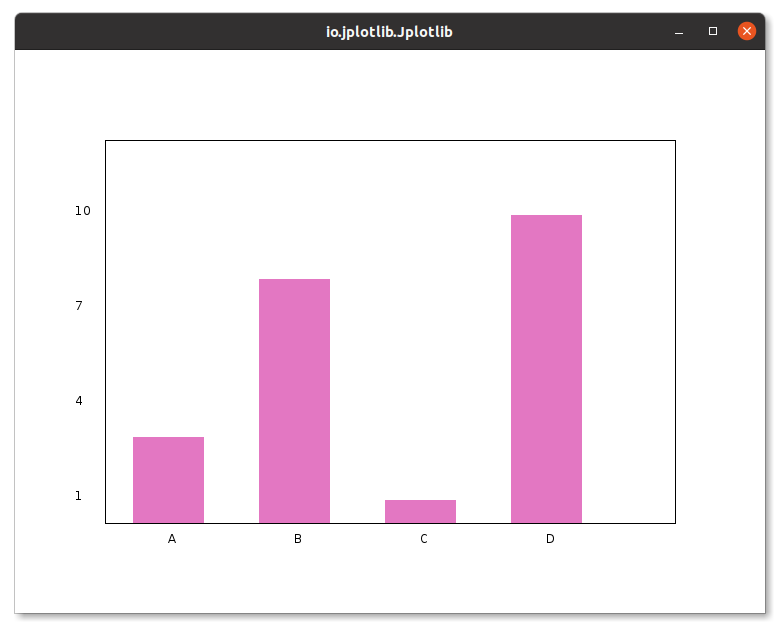

# Jplotlib.bar()

The `bar()` method in `Jplotlib` allows you to create 2D bar graphs with ease. This method is designed to visualize datasets using y-coordinates and labels for x-coordinates in the form of strings. It offers a convenient way to generate bar graph.

### Method Signature:

```java
bar(String[] xLabels, double[] yPoints)
```
The `bar()` method requires two arrays: `xLabels` containing labels for the x-coordinates (in String format) and `yPoints` containing the corresponding y-coordinates.

### Example Usage:

```java
import io.github.manishdait.jplotlib.Jplotlib;

public class App {
  public static void main(String[] args) {
    Jplotlib jplotlib = new Jplotlib();
    String[] x = {"A", "B", "C", "D"};
    double[] y = {3, 8, 1, 10};
    jplotlib.bar(x, y)
      .build();
    jplotlib.show();
  }
}
```
In this example, we use the `bar()` method to create a bar graph using `x` as the labels for the x-coordinates and `y` as the y-coordinates. Each bar in the graph represents a category defined by the labels, and its height corresponds to the respective value from `y`.



Bar graphs are particularly useful for comparing the values of different categories and displaying discrete data. They are commonly used to visualize categorical data and show how different groups or items compare with each other.


## Bar Color

In Jplotlib, similar to `.plot()`[.color()](PLOT.md) you can customize the color of the bars in a bar graph using the `.color()` method. This feature allows you to change the color of individual bars or sets of bars, making your bar graph more visually appealing and informative.

### Example Usage:

```java
import io.github.manishdait.jplotlib.Jplotlib;
import io.github.manishdait.jplotlib.style.color.BaseColor;

public class App {
  public static void main(String[] args) {
    Jplotlib jplotlib = new Jplotlib();
    String[] x = {"A", "B", "C", "D"};
    double[] y = {3, 8, 1, 10};
    jplotlib.bar(x, y)
      .color(BaseColor.PINK.getColor())
      .build();
    jplotlib.show();
  }
}
```

In this example, we use the `.color(BaseColor.PINK.getColor())` method with the `bar()` method to set the color of the bars in the bar graph to pink. You can use the `BaseColor` enum to choose from a variety of predefined colors like `BaseColor.RED`, `BaseColor.GREEN`, `BaseColor`.ORANGE, and more.



You can also use the java.awt.Color class to specify custom colors using RGB values, like `.color(new Color(255, 0, 0))` for red.

