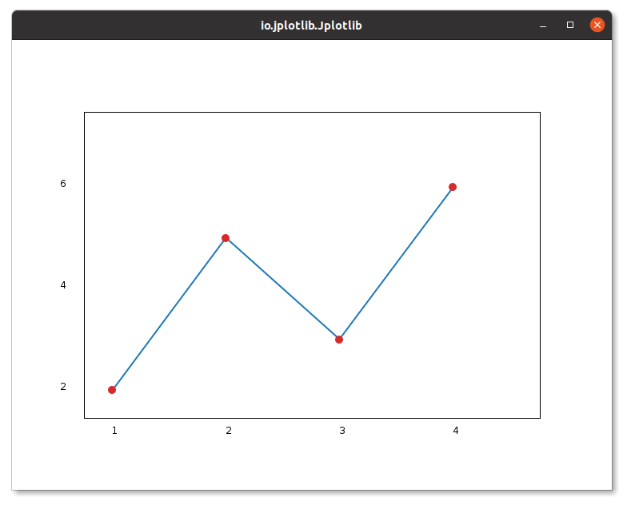

# BaseStroke Enum

The `BaseStroke` enum in Jplotlib provides options to customize the style of lines in plots.

### Available Styles:

Currently, the `BaseStoke` enum in Jplotlib provides two values for line style:

- `BaseStroke.NONE`: This value sets the line style to a solid line with no special decoration (default style).

- `BaseStroke.DASHED`: This value sets the line style to a dashed line.

### Example Usage:

```java
import io.github.manishdait.jplotlib.Jplotlib;
import io.github.manishdait.jplotlib.style.line.BaseStroke;

public class App {
  public static void main(String[] args) {
    double[] x = {1, 2, 3, 4};
    double[] y = {2.5, 5.1, 3.9, 6.2};

    Jplotlib jplotlib = new Jplotlib();
    jplotlib.plot(x, y)
      .lineStyle(BaseStroke.DASHED)
      .build();
    jplotlib.show();
  }
}
```

In this example, we use the `.lineStyle(BaseStroke.DASHED)` method to set the line style to dashed, overriding the default style which is `BaseStroke.NONE`.



You can use the `BaseStroke` enum to change the appearance of lines in your plots according to your preferences. If no specific style is set, it will use the default `BaseStroke.NONE`, which is a solid line.