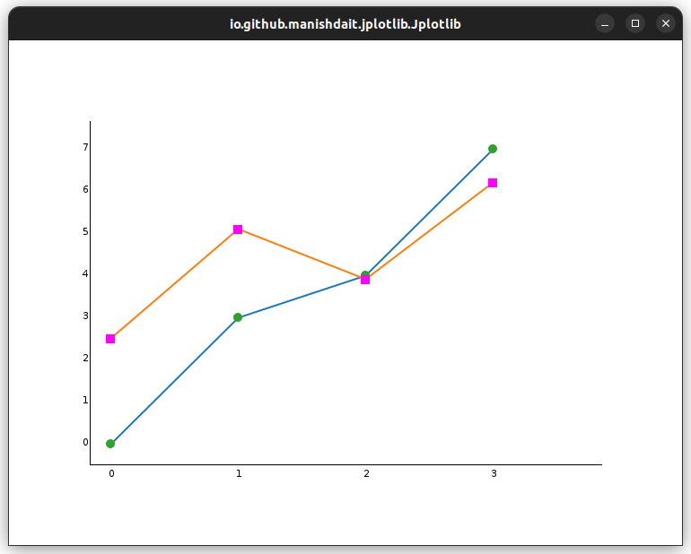

# LibColor Enum

The `LibColor` enum in Jplotlib provides a set of predefined colors that you can use to customize the appearance of your plots.

### Available LibColor:

- `LibColor.BLUE`
- `LibColor.ORANGE`
- `LibColor.GREEN`
- `LibColor.RED`
- `LibColor.PURPLE`
- `LibColor.BROWN`
- `LibColor.PINK`
- `LibColor.GREY`
- `LibColor.LIME`
- `LibColor.SKY`

### Example Usage:

```java
  import io.github.manishdait.jplotlib.Jplotlib;
  import io.github.manishdait.jplotlib.defaults.color.LibColor;
  import io.github.manishdait.jplotlib.defaults.marker.Marker;

  public class App {
    public static void main(String[] args) {
      double[] y1 = {0, 3, 4, 7};
      double[] y2 = {2.5, 5.1, 3.9, 6.2};

      Jplotlib jplotlib = new Jplotlib();
      jplotlib.plot(y1)
        .marker(Marker.CIRCLE)
        .markerColor(LibColor.GREEN.getColor());
      jplotlib.plot(y2)
        .marker(Marker.SQUARE)
        .markerColor(Color.MAGENTA);
      jplotlib.show();
    }
  }
```
In this example, we use the `.color(LibColor.BLUE.getColor())` method to set the line color to blue and `.markerColor(LibColor.RED.getColor())` to set marker color red using `LibColor` from Jplotlib. The `LibColor.BLUE` constant provides the predefined blue color and `LibColor.RED` constant provides predefine red color.



You can use any of the available LibColor constants to customize the color of lines, markers, or other visual elements in your plot according to your preferences.


