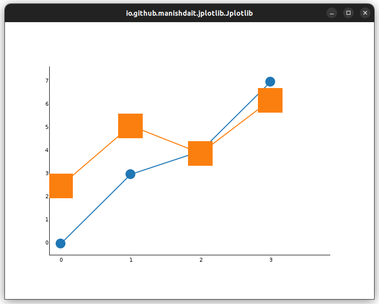

# Marker .marker()

The `Marker` feature in Jplotlib allows you to add visual markers to data points in your plots, making it easier to identify individual data points. Jplotlib provides a variety of marker types that you can use to customize the appearance of your data points.

### Available Marker Types:

Currently, Jplotlib provides three marker types:

- `Marker.NONE`: This value indicates no markers will be shown at the data points.

- `Marker.CIRCLE`: This value adds circular markers at the data points.

- `Marker.SQUARE`: This value adds square markers at the data points.


### Example Usage:

```java
import io.github.manishdait.jplotlib.Jplotlib;
import io.github.manishdait.jplotlib.defaults.marker.Marker;

public class App {
  public static void main(String[] args) {
    double[] y1 = {1, 2, 3, 4};
    double[] y2 = {2.5, 5.1, 3.9, 6.2};
    double[] y3 = {0, 3, 4, 7};

    Jplotlib jplotlib = new Jplotlib();
    jplotlib.plot(y1)
      .marker(Marker.NONE);
    jplotlib.plot(y2)
      .marker(Marker.CIRCLE);
    jplotlib.plot(y3)
      .marker(Marker.SQUARE);
    jplotlib.show();
  }
}
```

In above example we use `.marker(Marker.Circle)` to set marker as circle , `.marker(Marker.Square)` to set marker as square and `.marker(Marker.NONE)` to set no marker, `Marker.NONE` is the default marker style.


### Setting Marker Color:

You can customize the color of the markers using the `.markerColor()` method. This method accepts either the `LibColor` enum or `java.awt.Color`. You can find the available colors in the [LibColor Enum section](LIB_COLOR.md) below.

### Example Usage:

```java
import java.awt.Color;

import io.github.manishdait.jplotlib.Jplotlib;
import io.github.manishdait.jplotlib.defaults.color.LibColor;
import io.github.manishdait.jplotlib.defaults.marker.Marker;

public class App {
  public static void main(String[] args) {
    double[] y1 = {0, 3, 4, 7};
    double[] y2 = {2.5, 5.1, 3.9, 6.2};

    Jplotlib jplotlib = new Jplotlib();
    jplotlib.plot(y1)
      .marker(Marker.CIRCLE)
      .markerColor(LibColor.GREEN.getColor());
    jplotlib.plot(y2)
      .marker(Marker.SQUARE)
      .markerColor(Color.MAGENTA);
    jplotlib.show();
  }
}
```
In above we use `.markerColor(LibColor.GREEN.getColor())` method to set the marker color to green using the `LibColor` enum and `.markerColor(Color.MAGENTA)` from java.awt.Color.


### Setting Marker Size:

To adjust the size of the markers, you can use the `.markerSize()` method, which takes a value between 1 to 10. Larger values will result in bigger markers.

### Example Usage:

```java
import io.github.manishdait.jplotlib.Jplotlib;
import io.github.manishdait.jplotlib.defaults.marker.Marker;

public class App {
  public static void main(String[] args) {
    double[] y1 = {0, 3, 4, 7};
    double[] y2 = {2.5, 5.1, 3.9, 6.2};

    Jplotlib jplotlib = new Jplotlib();
    jplotlib.plot(y1)
      .marker(Marker.CIRCLE)
      .markerSize(4);
    jplotlib.plot(y2)
      .marker(Marker.SQUARE)
      .markerSize(10);
    jplotlib.show();
  }
}
```

In above we use `.markerSize(4)` and `.markerSize(10)` to set marker size and 4 and 10 respectivly.



You can use the `.marker()` feature to enhance the visibility of data points in your plots and tailor the markers according to your preferences. 
