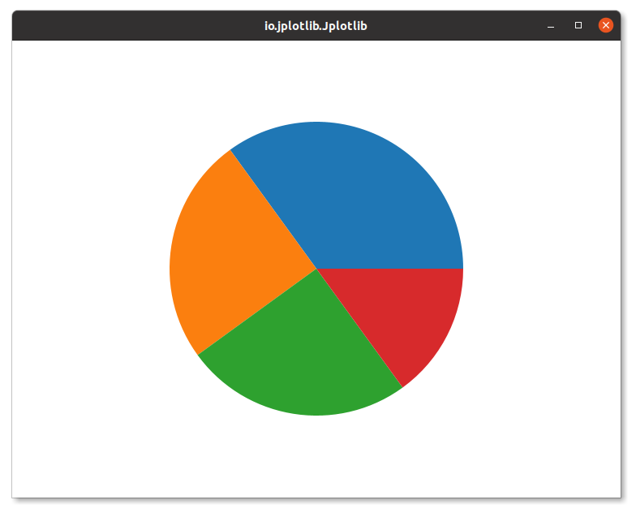

# Jplotlib.pie()

The `pie()` method in `Jplotlib` allows you to create 2D pie charts with ease. This method is designed to visualize datasets using data points to form a pie chart. It offers a convenient way to generate pie charts.

### Method Signature:

```java
pie(double[] dataPoints)
```
The `.pie()` method requires a single array: `dataPoints`, which contains numerical values representing the data points for the pie chart.

### Example Usage:

```java
import io.github.manishdait.jplotlib.Jplotlib;

public class App {
  public static void main(String[] args) {
    Jplotlib jplotlib = new Jplotlib();
    double[] dataPoints = {35, 25, 25, 15};
    jplotlib.pie(dataPoints)
      .build();
    jplotlib.show();
  }
}
```
In this example, we use the `pie()` method to create a pie chart using only the `dataPoints` array. The pie chart visually represents the proportion of each data point relative to the whole dataset.



Pie charts are useful for displaying parts of a whole and showing the relative distribution of different categories within a dataset.


## Colors

In Jplotlib, you can customize the colors of each pie section in a pie chart by providing an array of colors as an argument to the `.color()` method. This feature allows you to specify different colors for individual pie sections, making your pie chart visually appealing and distinct.

### Example Usage:

```java
import java.awt.Color;

import io.github.manishdait.jplotlib.Jplotlib;
import io.github.manishdait.jplotlib.style.color.BaseColor;

public class App {
  public static void main(String[] args) {
    Jplotlib jplotlib = new Jplotlib();
    double[] dataPoints = {35, 25, 25, 15};
    Color[] colors = {BaseColor.GREY.getColor(), BaseColor.PINK.getColor(), Color.CYAN, Color.MAGENTA};
    jplotlib.pie(dataPoints)
      .color(colors)
      .build();
    jplotlib.show();
  }
}
```

In this example, we use the `.color(colors)` method with the `pie()` method to set different colors for each pie section. The colors array contains colors from the BaseColor enum, specifying the color for each corresponding data point in the dataPoints array.


You can also use the java.awt.Color class to specify custom colors using RGB values, like `.color(new Color[]{Color.BLUE, Color.GREEN, Color.ORANGE, Color.RED})`.

