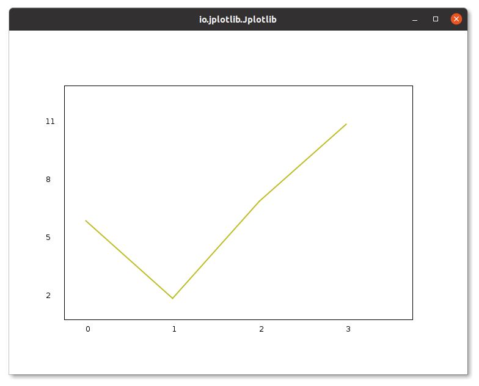
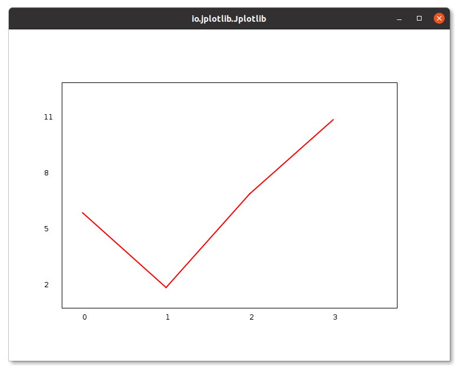
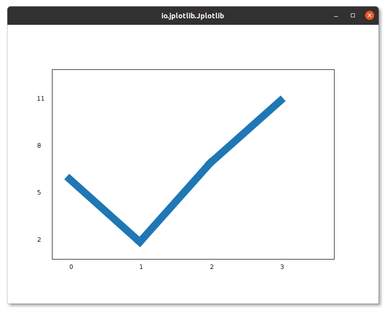
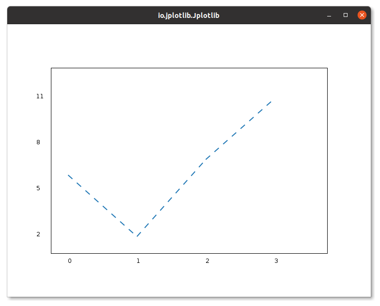
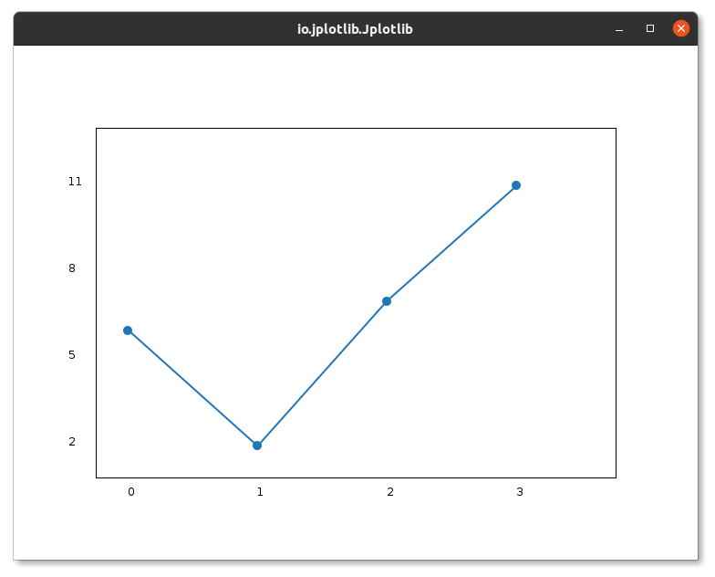
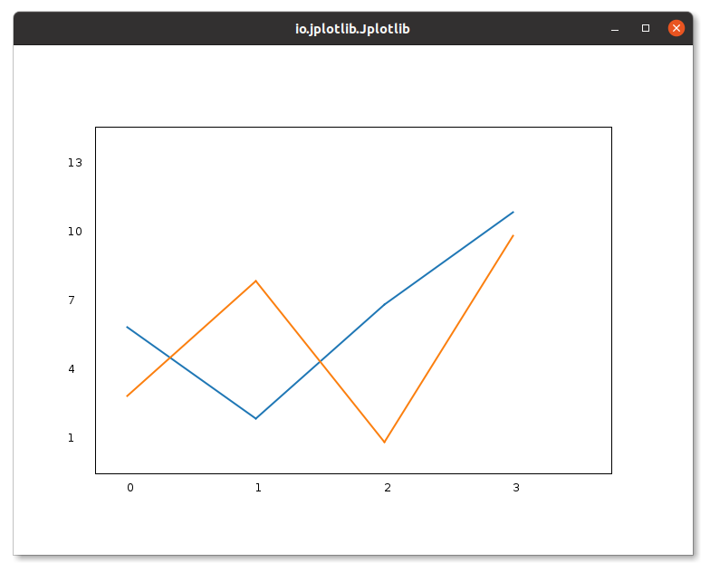

# Jplotlib.plot()

The `plot()` method in the `Jplotlib.plot()` allows you to create 2D line plots with ease. This method is designed to visualize datasets using y-coordinates, and it offers two convenient ways to generate plots:

## Method Signatures

1. `plot(double[] yPoints)`: 
   - Description: Plots a 2D line graph using the provided y-coordinates.
   - Default x-values: The x-coordinates start from 0 and increment by 1 for each point.
   - Example usage:
     ```java
     new Jplotlib.plot(new double[]{2.5, 5.1, 3.9, 6.2});
     ```

2. `plot(double[] xPoints, double[] yPoints)`:
   - Description: Plots a 2D line graph using the given x-coordinates and y-coordinates.
   - Example usage:
     ```java
     double[] xCoords = {1.0, 2.0, 3.0, 4.0};
     double[] yCoords = {2.5, 5.1, 3.9, 6.2};
     new Jplotlib.plot(xCoords, yCoords);
     ```


## Line Color

To customize the color of the line in the plot, you can use the `.color()` method available in the Jplotlib library. This method allows you to specify the color using either the `BaseColor` enum from Jplotlib or the `java.awt.Color` class.

### Using `BaseColor` from Jplotlib:

The `BaseColor` enum provides a set of predefined colors that you can use to style the line in your plot. Here's an example of how to use it:

```java
import io.github.manishdait.jplotlib.Jplotlib;
import io.github.manishdait.jplotlib.style.color.BaseColor;

public class App {
  public static void main(String[] args) {
    Jplotlib jplotlib = new Jplotlib();
    double[] y1 = {6, 2, 7, 11};
    jplotlib.plot(y1)
      .color(BaseColor.LIME.getColor())
      .build();
    jplotlib.show();
  }
}
```

In this example, we use the `.color(BaseColor.LIME.getColor())` method to set the color of the line to lime.



For more information about the `BaseColor` enum and the available colors, refer to the [BaseColor Enum section](BASE_COLOR.md).


### Using `java.awt.Color`:

If you prefer to use the `java.awt.Color` class, you can do so as follows:

```java
import java.awt.Color;
import io.github.manishdait.jplotlib.Jplotlib;

public class App {
  public static void main(String[] args) {
    Jplotlib jplotlib = new Jplotlib();
    double[] y1 = {6, 2, 7, 11};
    jplotlib.plot(y1)
      .color(Color.RED)
      .build();
    jplotlib.show();
  }
}
```

In this example, we use the `.color(Color.RED)` method to set the color of the line to red.



Whichever method you choose, the `.color()` method allows you to customize the appearance of your line plots with different colors according to your preferences.


## Line Style

To change the width of the line in the plot, you can use the `.lineWidth()` method available in the `Jplotlibplot()`.

### Example Usage:

```java
import io.github.manishdait.jplotlib.Jplotlib;

public class App {
  public static void main(String[] args) {
    Jplotlib jplotlib = new Jplotlib();
    double[] y1 = {6, 2, 7, 11};
    jplotlib.plot(y1)
      .lineWidth(15F)
      .build();
    jplotlib.show();
  }
}
```

In this example, we use the `.lineWidth(15F)` method to set the width of the line to 15.




### Valid Range:

The value passed to `.lineWidth()` should be a floating-point number between 1 and 15. A smaller value makes the line thinner, while a larger value makes it thicker. For example, using `.linewidth(1F)` will create a thin line, whereas `.linewidth(15F)` will create a thicker line.


## Line Style

To change the style of the plotted line in the `Jplotlib.plot()` method, you can use the `.lineStyle()` method. This method allows you to customize the appearance of the line using the `BaseStoke` enum from Jplotlib, which currently contains two possible values: `NONE` and `DASHED`.

### Example Usage:
```java
import io.github.manishdait.jplotlib.Jplotlib;
import io.github.manishdait.jplotlib.style.line.BaseStroke;

public class App {
  public static void main(String[] args) {
    Jplotlib jplotlib = new Jplotlib();
    double[] y1 = {6, 2, 7, 11};
    jplotlib.plot(y1)
      .lineStyle(BaseStroke.DASHED)
      .build();
    jplotlib.show();
  }
}
```

In this example, we use the `.lineStyle(BaseStroke.DASHED)` method to set the style of the line to dashed.



For more information about the `BaseStroke` enum and the available styles, refer to the [BaseStroke Enum section](BASE_STROKE.md).


## Line Marker

To add markers to line points in `Jplotlib.plot()`, you can use the `.marker()` method. This method allows you to customize the appearance of the markers using the `BaseMarker` enum from Jplotlib, which currently supports two marker types: `NONE`, `CIRCLE`, and `SQUARE`.

### Example Usage:

```java
import io.github.manishdait.jplotlib.Jplotlib;
import io.github.manishdait.jplotlib.style.marker.BaseMarker;

public class App {
  public static void main(String[] args) {
    Jplotlib jplotlib = new Jplotlib();
    double[] y1 = {6, 2, 7, 11};
    jplotlib.plot(y1)
      .marker(BaseMarker.CIRCLE)
      .build();
    jplotlib.show();
  }
}
```

In this example, we use the `.marker(BaseMarker.CIRCLE)` method to add circular markers to the line points.



For more information about the `Marker` and how to use, refer to the [Marker section](MARKER.md).

## Multiples Lines

You can plot as many lines as you like by simply adding more `Jplotlib.plot()` method calls:

### Example Usage:

```java
import io.github.manishdait.jplotlib.Jplotlib;

public class App {
  public static void main(String[] args) {
    Jplotlib jplotlib = new Jplotlib();
    double[] y1 = {6, 2, 7, 11};
    double[] y2 = {3, 8, 1, 10};
    jplotlib.plot(y1)
      .build();
    jplotlib.plot(y2)
      .build();
    jplotlib.show();
  }
}
```

In this example, we create two sets of y-coordinates (`y1` and `y2`) and plot them using two separate `Jplotlib.plot()` method calls. We customize the appearance of each line using different line styles and markers.



You can extend this approach to plot any number of lines by adding more `Jplotlib.plot()` method calls with their respective datasets and customizations.

You can also plot multiple lines by specifying both the `x` and `y` coordinates for each line in the same `plt.plot()` function. The x and y values should come in pairs:

(In the examples above we only specified the points on the y-axis, meaning that the points on the x-axis got the the default values (0, 1, 2, 3).)

The x- and y- values come in pairs:

### Example Usage:

```java
import io.github.manishdait.jplotlib.Jplotlib;

public class App {
  public static void main(String[] args) {
    Jplotlib jplotlib = new Jplotlib();
    double[] x1 = {0, 1, 2, 3};
    double[] x2 = {2, 3, 4, 5};
    double[] y1 = {6, 2, 7, 11};
    double[] y2 = {3, 8, 1, 10};
    jplotlib.plot(x1, y1)
      .build();
    jplotlib.plot(x2, y2)
      .build();
    jplotlib.show();
  }
}
```

In this example, we create two sets of y-coordinates (`y1` and `y2`) and  two sets of x-coordinates (`x1` and `x2`) and plot them using two separate `Jplotlib.plot()` method calls.


