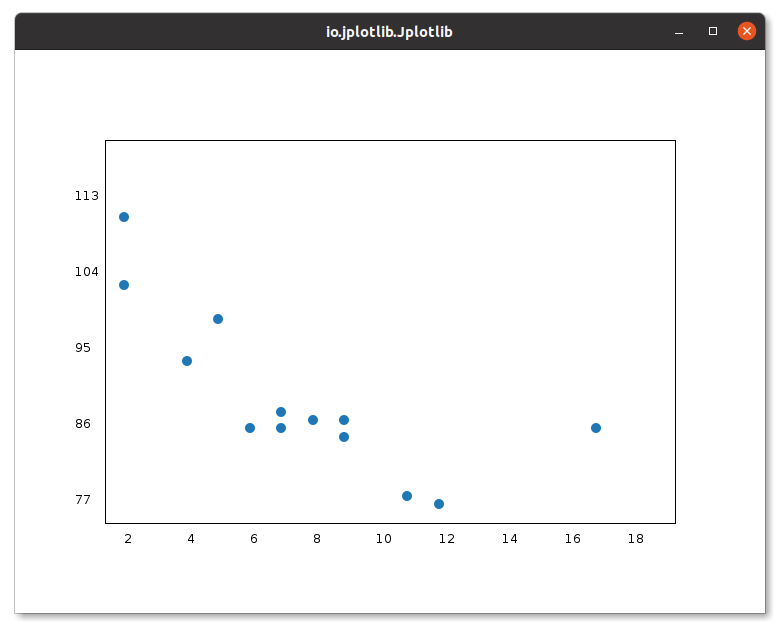
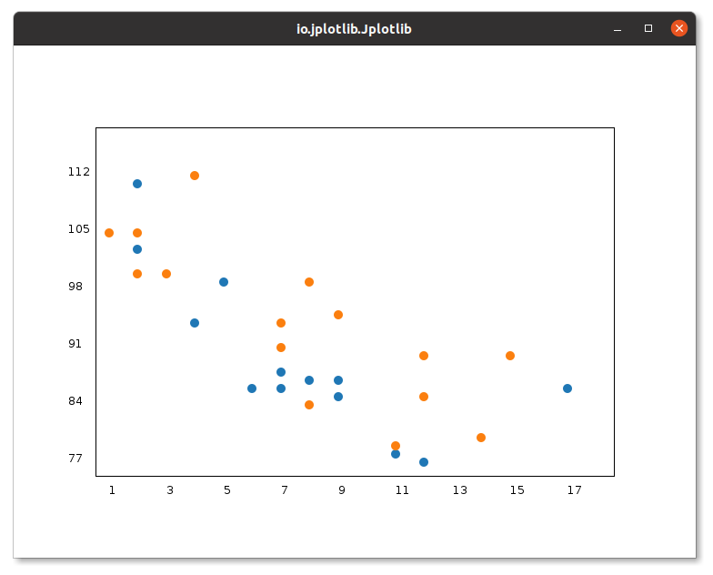
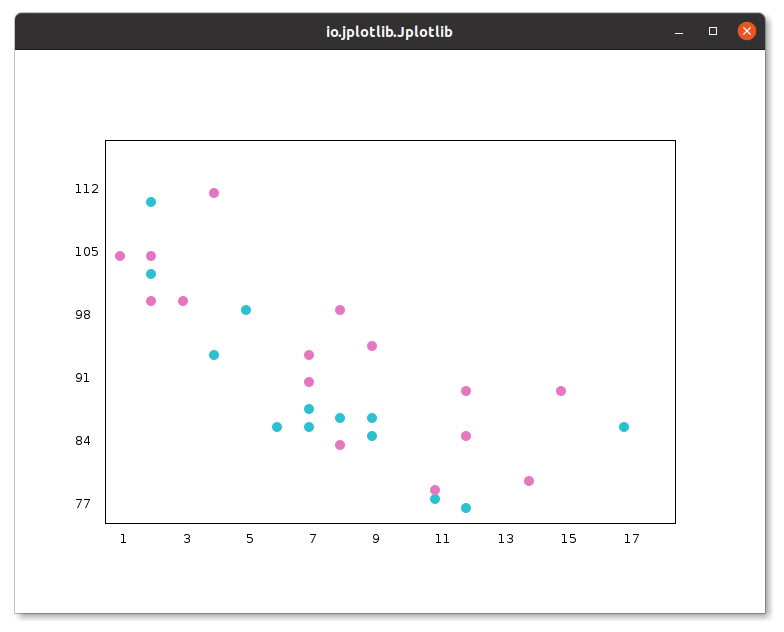
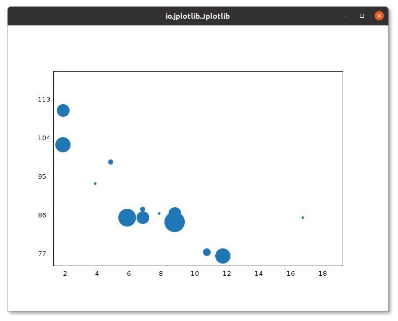
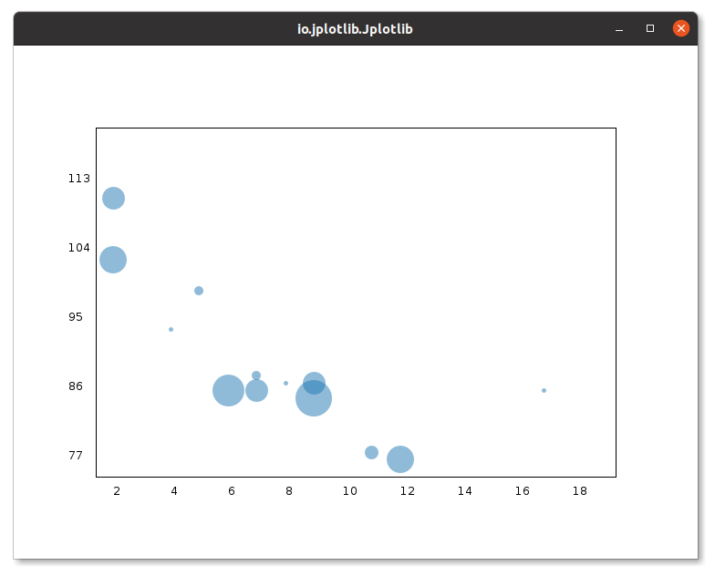
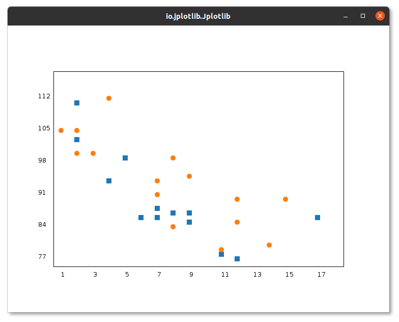

# Jplotlib.scatter()

The `scatter()` method in `Jplotlib` allows you to create 2D scatter plots with ease. This method is designed to visualize datasets using both x-coordinates and y-coordinates, and it offers a convenient ways to generate plots:

## Method Signatures:

 `scatter(double[] xPoints, double[] yPoints)`: 
   - Description: Plots a 2D scatter plot using the provided x-coordinates and y-coordinates.
   - Example usage:
     ```java
      double[] xCoords = {1.0, 2.0, 3.0, 4.0};
      double[] yCoords = {2.5, 5.1, 3.9, 6.2};
      new Jplotlib.scatter(xCoords, yCoords);
     ```

## Creating Scatter Plots

In Jplotlib, you can use the `scatter()` method to draw scatter plots, which are a type of plot that displays individual data points as dots. Scatter plots are useful for visualizing the distribution and relationships between two numerical variables.

The `scatter()` method requires two arrays of the same length: one for the values of the x-axis and another for the values on the y-axis. Each data point in the scatter plot corresponds to a pair of x and y values from these arrays.

### Example Usage:

```java
import io.github.manishdait.jplotlib.Jplotlib;

public class App {
  public static void main(String[] args) {
    double[] x = {5,7,8,7,2,17,2,9,4,11,12,9,6};
    double[] y = {99,86,87,88,111,86,103,87,94,78,77,85,86};

    Jplotlib jplotlib = new Jplotlib();
    jplotlib.scatter(x, y)
      .build();
    jplotlib.show();
  }
}
```

In this example, we use the `scatter()` method to create a scatter plot using `x` as the x-coordinates and `y` as the y-coordinates. Each point in the plot represents a pair of x and y values from the given arrays.




## Compare Plots

In Jplotlib, you can create compare plots by using two `scatter()` methods, allowing you to visualize and compare two datasets side by side. This technique is particularly useful when you want to observe the relationship between two variables across two different conditions or scenarios.

### Example Usage:

```java
import io.github.manishdait.jplotlib.Jplotlib;

public class App {
  public static void main(String[] args) {
    double[] x1 = {5,7,8,7,2,17,2,9,4,11,12,9,6};
    double[] x2 = {2,2,8,1,15,8,12,9,7,3,11,4,7,14,12};
    double[] y1 = {99,86,87,88,111,86,103,87,94,78,77,85,86};
    double[] y2 = {100,105,84,105,90,99,90,95,94,100,79,112,91,80,85};

    Jplotlib jplotlib = new Jplotlib();
    jplotlib.scatter(x1, y1)
      .build();
    jplotlib.scatter(x2, y2)
      .build();
    jplotlib.show();
  }
}
```
In this example, we use two `scatter()` methods to create two separate scatter plots. The first scatter() method creates a scatter plot using `x1` as the x-coordinates and `y1` as the y-coordinates, and the second scatter() method creates another scatter plot using `x2` and `y2`.




## Colors

In Jplotlib, you have the flexibility to set your own color for each scatter plot using the `.color()` method. This feature allows you to customize the appearance of individual scatter plots, making it easier to distinguish different datasets or conditions in your visualizations. Similar to `plot().`[.color()](PLOT.md) you can use `BaseColor` enum of `java.awt.Color`.

### Example Usage:
```java
import io.github.manishdait.jplotlib.Jplotlib;
import io.github.manishdait.jplotlib.style.color.BaseColor;

public class App {
  public static void main(String[] args) {
    double[] x1 = {5,7,8,7,2,17,2,9,4,11,12,9,6};
    double[] x2 = {2,2,8,1,15,8,12,9,7,3,11,4,7,14,12};
    double[] y1 = {99,86,87,88,111,86,103,87,94,78,77,85,86};
    double[] y2 = {100,105,84,105,90,99,90,95,94,100,79,112,91,80,85};

    Jplotlib jplotlib = new Jplotlib();
    jplotlib.scatter(x1, y1)
      .color(BaseColor.SKY.getColor())
      .build();
    jplotlib.scatter(x2, y2)
    .color(BaseColor.PINK.getColor())
      .build();
    jplotlib.show();
  }
}
```

In this example, we use the `.color(BaseColor.SKY.getColor())` argument with the first scatter() method to set the color of the first scatter plot to light_blue. Similarly, we use `.color(BaseColor.PINK.getColor())` with the second scatter() method to set the color of the second scatter plot to pink.



For a complete list of available colors from the `BaseColor` enum, you can refer to the [BaseColor Enum](BASE_COLOR.md).


## Size

## Size

In Jplotlib, you can change the size of the dots in each scatter plot using the `.size()` argument. This feature allows you to adjust the size of individual data points, making them more visually distinguishable and highlighting specific data values in your scatter plots. It takes value between 1 to 10.

### Example Usage:

```java
import io.github.manishdait.jplotlib.Jplotlib;

public class App {
  public static void main(String[] args) {
    double[] x = {5,7,8,7,2,17,2,9,4,11,12,9,6};
    double[] y = {99,86,87,88,111,86,103,87,94,78,77,85,86};
    int[] size = {2,5,1,2,5,1,6,5,1,3,6,8,7};

    Jplotlib jplotlib = new Jplotlib();
    jplotlib.scatter(x, y)
      .size(size)
      .build();
    jplotlib.show();
  }
}
```

In this example, we use the `.size()` argument with both scatter() methods to set the size of the dots for each data point. By customizing the size of each dot, you can emphasize specific data points or highlight patterns in the data, enhancing the overall visual representation of your scatter plots.




## Alpha

In Jplotlib, you can adjust the transparency of the dots in scatter plots using the `.alpha()` method. This feature allows you to control the opacity of data points, making the scatter plot visually more informative and expressive.

### Example Usage:

```java
import io.github.manishdait.jplotlib.Jplotlib;

public class App {
  public static void main(String[] args) {
    double[] x = {5,7,8,7,2,17,2,9,4,11,12,9,6};
    double[] y = {99,86,87,88,111,86,103,87,94,78,77,85,86};
    int[] size = {2,5,1,2,5,1,6,5,1,3,6,8,7};

    Jplotlib jplotlib = new Jplotlib();
    jplotlib.scatter(x, y)
      .size(size)
      .alpha(0.5F)
      .build();
    jplotlib.show();
  }
}
```

In this example, we use the `.alpha()` argument with the scatter() method to set the transparency (opacity) of the dots in the scatter plot. The `alphaValue` is a float value between 0 and 1, where 0 means completely transparent (invisible) dots, and 1 means completely opaque (fully visible) dots.

By adjusting the transparency of the dots, you can reveal underlying patterns in the data, especially when data points overlap or cluster closely together. It helps in visualizing the density of data points and identifying areas with higher concentration.




## Marker

In Jplotlib, you can change the style of markers for scatter points using the `.marker()` method. This feature allows you to customize the appearance of individual data points in scatter plots, making it easier to identify different data categories or highlight specific data points.

### Example Usage:

```java
import io.github.manishdait.jplotlib.Jplotlib;
import io.github.manishdait.jplotlib.style.marker.BaseMarker;

public class App {
  public static void main(String[] args) {
    double[] x1 = {5,7,8,7,2,17,2,9,4,11,12,9,6};
    double[] x2 = {2,2,8,1,15,8,12,9,7,3,11,4,7,14,12};
    double[] y1 = {99,86,87,88,111,86,103,87,94,78,77,85,86};
    double[] y2 = {100,105,84,105,90,99,90,95,94,100,79,112,91,80,85};

    Jplotlib jplotlib = new Jplotlib();
    jplotlib.scatter(x1, y1)
      .marker(BaseMarker.SQUARE)
      .build();
    jplotlib.scatter(x2, y2)
      .build();
    jplotlib.show();
  }
}
```

In this example, we use the `.marker(BaseMarker.SQUARE)` method with the `.scatter()` method to set the style of the marker for the scatter points. The `BaseMarker.SQUARE` value specifies that square markers will be used for each data point in the scatter plot.



You can use various marker styles, such as `BaseMarker.NONE`, `BaseMarker.CIRCLE`, or `BaseMarker.SQUARE`, to change the appearance of the data points in the scatter plot.

For a complete list of available marker types and more details, you can refer to the [Marker Section](MARKER.md). Here the difference is that the `BaseMarker.NONE` will work same as `BaseMarker.CIRCLE`.

