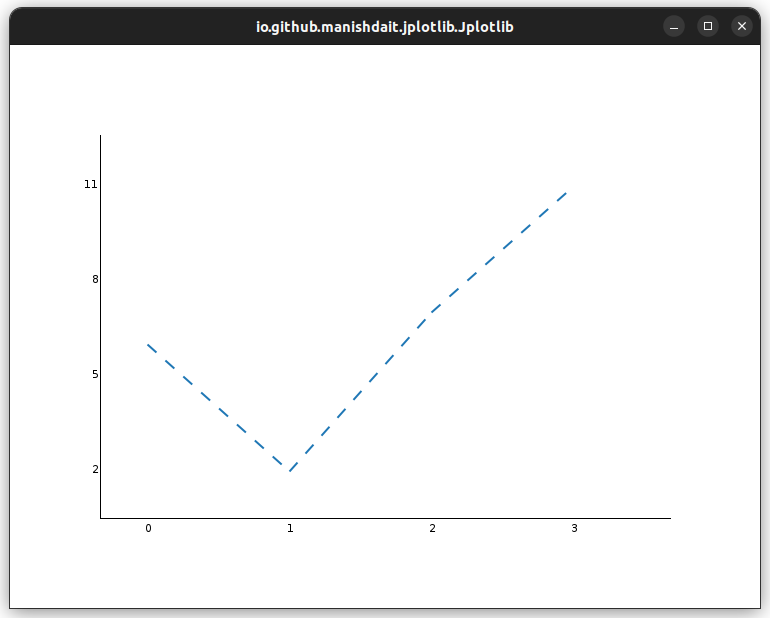

# Stroke Enum

The `Stroke` enum in Jplotlib provides options to customize the style of lines in plots.

### Available Styles:

Currently, the `Stoke` enum in Jplotlib provides two values for line style:

- `Stroke.NONE`: This value sets the line style to a solid line with no special decoration (default style).

- `Stroke.DASHED`: This value sets the line style to a dashed line.

### Example Usage:

```java
import io.github.manishdait.jplotlib.Jplotlib;
import io.github.manishdait.jplotlib.defaults.line.Stroke;

public class App {
  public static void main(String[] args) {
    Jplotlib jplotlib = new Jplotlib();
    double[] y1 = {6, 2, 7, 11};
    jplotlib.plot(y1)
      .lineStyle(Stroke.DASHED);
    jplotlib.show();
  }
}
```

In this example, we use the `.lineStyle(Stroke.DASHED)` method to set the line style to dashed, overriding the default style which is `Stroke.NONE`.



You can use the `Stroke` enum to change the appearance of lines in your plots according to your preferences. If no specific style is set, it will use the default `Stroke.NONE`, which is a solid line.